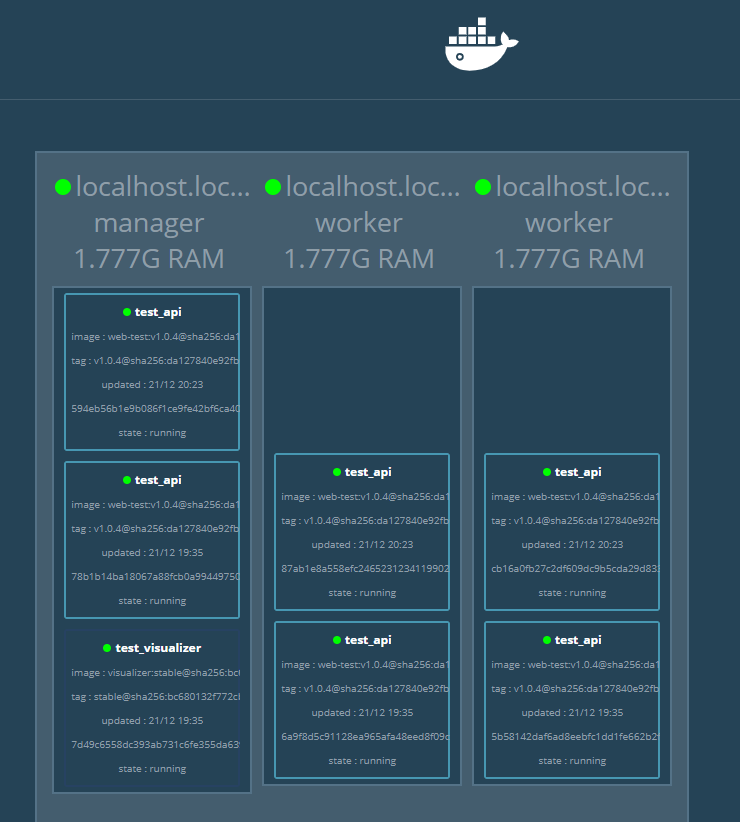
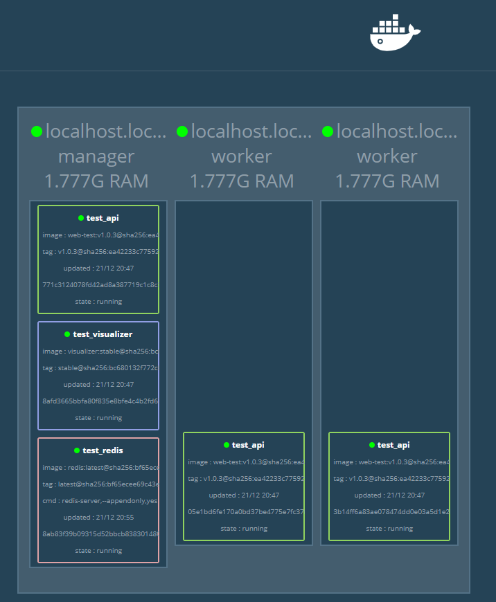

# Docker Stack 是什么？

Docker Stack（栈）是一组相互关联的服务，用于构成特定环境的服务（`service`）集合，他们之间可以共享依赖关系，可以一起进行 **编排** 和 **伸缩**。更主要的是，Docker Stack 是自动部署多个相互关联的服务的简便方法，而无需单独的定义每个服务。

自动部署从 `Docker Swarm` 中就可以了解动，不管是服务升级还是节点扩充都不需要杀死进程重新部署，完全的做到了无缝升级。`Docker Stack` 同样的做到了这点。

另外，`Docker Swarm` 由 `docker-compose.yml` 文件定义 **一个** 服务，`Docker Stack` 同样也是由 `YAML` 文件定义而且格式与 `swarm` 也相同。不同的是他可以定义一个或多个服务、定义服务的环境变量、部署标签、容器数量以及相关的环境的特定配置。

在使用 `swarm` 部署服务时一直使用 `docker stack deploy` 进行部署，事实上就已经使用了 `docker stack`。但之前是一直在集群上运行单个服务堆栈（`docker stack`），而 `docker stack` 完全能做到多个服务的堆栈。


# 机器准备

准备三台机器：

- `192.168.31.131`：管理节点
- `192.168.31.133`：工作节点
- `192.168.31.134`：工作节点

# Swarm 集群连接

在管理节点运行初始化 `docker swarm init` 集群命令，在工作节点中进行加入集群。

```
$ docker swarm init
Swarm initialized: current node (a5yy7q2vej26awg4u2oggsh2c) is now a manager.

To add a worker to this swarm, run the following command:

    docker swarm join --token SWMTKN-1-18r6yasvao26coicfgzuuaalj9jjqhbml5soynuq6veho9dc6p-9kx5o04muohxh57o00t5za92y 192.168.31.131:2377

To add a manager to this swarm, run 'docker swarm join-token manager' and follow the instructions.
```

工作节点：

```
$ docker swarm join --token SWMTKN-1-18r6yasvao26coicfgzuuaalj9jjqhbml5soynuq6veho9dc6p-9kx5o04muohxh57o00t5za92y 192.168.31.131:2377
This node joined a swarm as a worker.
```

> **[warning] 注意**
>
> 工作节点在加入管理节点之前，要保证管理节点已开启响应端口，具体见 [Docker 集群](./multi-machine-build-swarms.md)

节点加入后在管理节点查看响应节点：

```
$ docker node ls
ID                            HOSTNAME                STATUS              AVAILABILITY        MANAGER STATUS      ENGINE VERSION
a5yy7q2vej26awg4u2oggsh2c *   localhost.localdomain   Ready               Active              Leader              18.09.0
wmqub1palaexbolc8oagv596x     localhost.localdomain   Ready               Active                                  18.09.0
x820d1ouccm5i8vnaqr15zmtb     localhost.localdomain   Ready               Active                                  18.09.0
```

节点加入成功

# 构建 visualizer 服务

在之前已经通过 `docker-compose.yml` 构建了 `ifkeeper/web-test:v1.0.3` 服务，使用 `docker stack` 部署多个多个服务的堆栈也很简单，只需要在之前的 `docekr-compose.yml` 做些修改即可。

在管理节点拷贝之前的 `YAML` 文件，命令为 `docker-compose-WITH-VISUALIZER.yml`，内容如下：

```yaml
version: "3"

services:
  api:
    image: ifkeeper/web-test:v1.0.3
    deploy:
      replicas: 3
      resources:
        limits:
          cpus: "0.1"
          memory: 1G
      restart_policy:
        condition: on-failure
    ports:
      - "80:80"
    networks:
      - webnet
  visualizer:
    image: dockersamples/visualizer:stable
    ports:
      - "8080:8080"
    volumes:
      - "/var/run/docker.sock:/var/run/docker.sock"
    deploy:
      replicas: 1
      placement:
        constraints: [node.role == manager]
    networks:
      - webnet

networks:
  webnet:

```

可以看到相比之前只是多了：

```yaml
  visualizer:
    image: dockersamples/visualizer:stable
    ports:
      - "8080:8080"
    volumes:
      - "/var/run/docker.sock:/var/run/docker.sock"
    deploy:
      replicas: 1
      placement:
        constraints: [node.role == manager]
    networks:
      - webnet
```

这里增加了 `api` 的对等服务 `visualizer`。这个服务是个可视化服务，另外增加了 `volumes` 键（使可视化程序能够访问 `Docker` 的主机套接字文件） 和 `placement` 键
（用于确保此服务仅在 `swarm` 管理节点上运行，而从不在工作节点上运行）。

下面就开始运行该堆栈服务：

```
$ docker stack deploy -c docker-stack-WITH-VISUALIZER.yml test
Creating network test_webnet
Creating service test_api
Creating service test_visualizer
```

在管理节点，查看服务运行情况：

T1
```
$ docker service ls
ID                  NAME                    MODE                REPLICAS            IMAGE                             PORTS
my5nlwo6t2v5        test_api          replicated          0/3                 ifkeeper/web-test:v1.0.3          *:80->80/tcp
57rdpsjm06ds        test_visualizer   replicated          0/1                 dockersamples/visualizer:stable   *:8080->8080/tcp
```

T2
```
$ docker service ls
ID                  NAME                    MODE                REPLICAS            IMAGE                             PORTS
my5nlwo6t2v5        test_api          replicated          2/3                 ifkeeper/web-test:v1.0.3          *:80->80/tcp
57rdpsjm06ds        test_visualizer   replicated          0/1                 dockersamples/visualizer:stable   *:8080->8080/tcp
```

T3
```
$ docker service ls
ID                  NAME                    MODE                REPLICAS            IMAGE                             PORTS
my5nlwo6t2v5        test_api          replicated          3/3                 ifkeeper/web-test:v1.0.3          *:80->80/tcp
57rdpsjm06ds        test_visualizer   replicated          1/1                 dockersamples/visualizer:stable   *:8080->8080/tcp
```

在 T1、T2 时间正在下载相关镜像，在T3时间运行并且部署成功。

在管理节点与工作节点分别查看正在运行镜像（任务），会看到在管理节点有两个运行中的容器，而工作节点都是只有一个：

管理节点
```
$ docker ps
CONTAINER ID        IMAGE                             COMMAND                  CREATED             STATUS              PORTS               NAMES
02efb2b2560d        ifkeeper/web-test:v1.0.3          "java -jar /app/dock…"   3 minutes ago       Up 3 minutes                            test_api.3.l3bltodx2o7wx5tp6y2fcjwes
0b48152f9a1a        dockersamples/visualizer:stable   "npm start"              3 minutes ago       Up 3 minutes        8080/tcp            test_visualizer.1.ssv5jpu7z8o5cj9261idfsznd
```

工作节点
```
$ docker ps
CONTAINER ID        IMAGE                      COMMAND                  CREATED             STATUS              PORTS               NAMES
f3ee0b92ebea        ifkeeper/web-test:v1.0.3   "java -jar /app/dock…"   2 minutes ago       Up 2 minutes                            test_api.1.t8svu8agkpiiqeov345unod8c
```

由于在 `docker-compose-WITH-VISUALIZER` 中配置了 `constraints: [node.role == manager]`。因此，可视化程序并没有在工作节点中运行任务。

另外，可视化程序对外暴露的端口号为 `8080`，可以通过管理节点进行访问：`192.168.31.131:8080`


由于可视化程序可以访问 `Docker` 的主机套接字文件，因此可以向当前管理节点（`swarm`集群）的工作节点、工作节点运行的任务都显示出来。

现在，再试着将 `api` 服务的节点由 3 个扩充动 6 个：

```yaml
services:
  api:
    image: ifkeeper/web-test:v1.0.3
    deploy:
      replicas: 6
      resources:
        limits:
          cpus: "0.1"
          memory: 1G
      restart_policy:
        condition: on-failure
    ports:
      - "80:80"
    networks:
      - webnet
```

进行重新部署，在管理节点上看下服务状态：

```
$ docker service ls
ID                  NAME                MODE                REPLICAS            IMAGE                             PORTS
m6rryd33jtx3        test_api            replicated          6/6                 ifkeeper/web-test:v1.0.4          *:80->80/tcp
v8kdkd4mnhnj        test_visualizer     replicated          1/1                 dockersamples/visualizer:stable   *:8080->8080/tcp
```

可以看到 `test_api` 服务由3个节点扩充到6个几点。并且这些任务均匀的运行在三个节点上。可以在工作节点上输入 `docker ps` 指令查看正在运行的容器（任务）。

再次访问 `8080` 端口：



可视化程序是一项独立服务，它可以在技术栈中的任何应用（包括它自己）中运行。它不依赖于任何其他内容。现在，我们创建具有依赖项的服务：将提供访客计数器的 Redis 服务。

# Redis 依赖服务

拷贝一份 `docker-compose-WITH-VISUALIZER.yml` 重名了为 `docker-compose-WITH-REDIS.yml`：

```
$ ls
docker-compose-WITH-REDIS.yml  docker-compose-WITH-VISUALIZER.yml
```

修改 `docker-compose-WITH-REDIS.yml`，内容如下：

```yaml
version: "3"

services:
  api:
    image: ifkeeper/web-test:v1.0.3
    deploy:
      replicas: 3
      resources:
        limits:
          cpus: "0.1"
          memory: 1G
      restart_policy:
        condition: on-failure
    ports:
      - "80:80"
    networks:
      - webnet
  visualizer:
    image: dockersamples/visualizer:stable
    ports:
      - "8080:8080"
    volumes:
      - "/var/run/docker.sock:/var/run/docker.sock"
    deploy:
      replicas: 1
      placement:
        constraints: [node.role == manager]
    networks:
      - webnet
  redis:
    image: redis:latest
    ports:
      - "6379:6379"
    volumes:
      - "/home/docker/data:/data"
    deploy:
      replicas: 1
      placement:
        constraints: [node.role == manager]
    command: redis-server --appendonly yes
    networks:
      - webnet

networks:
  webnet:
```

仅仅是在 `stack` 部署文件中增加了 `redis` 服务。

Redis 具有 Docker 库中的官方镜像，并且为其指定了短 `image` 名称 `redis`，因此此处没有 `username/repo` 表示法。
Redis 已将 Redis 端口 6379 预先配置为从容器开放给主机，并且在此处的 Compose 文件中，将其从主机开放给整个环境，因此
实际上可以将任何节点的 IP 输入 Redis Desktop 管理节点中并管理此 Redis 实例。

最重要的是，`redis` 规范中的一些内容可以在此技术栈的部署之间持久存储数据：

- `redis` 始终在管理节点上运行，因此它始终使用同一文件系统。
- `redis` 将访问主机文件系统中的任意目录，作为容器内的 `/home/docker/data`，这是 Redis 存储数据的位置。

> **[warning] volumes 挂载**
>
> 由于在通常情况下，docker 容器不能作为数据存储。因为当运行中的 `docker container` 关闭后容器中的数据就会被清除。除非使用 `commit` 命令将该容器在顶层增加一个只读层成为
> 一个镜像。而 `volumes` 的作用就是能将主机上的文件或文件夹挂载到 `docker comtainer` 中，这样容器中的数据就成传输到主机上，得以将数据进行持久保存。具体见 [理解 Docker Volume]()。

现在就可以将应用进行查询重新部署了。

需要说明的是，最好将之前的 `stack` 和 `service` 清理掉，或者在部署是将该 `stack` 继续命令为之前的名字。由于 `visualizer` 可视化访问的是 docker 主机的套接字文件，在同一
主机运行多个堆栈（`stack`）应用时可能会导致节点显示错乱问题。

笔者这里将其关闭掉再进行重新部署：

```
$ docker stack rm test
Removing service test_api
Removing service test_visualizer
Removing network test_webnet

$ docker service ls
ID                  NAME                MODE                REPLICAS            IMAGE               PORTS
[root@localhost yml]# docker ps
CONTAINER ID        IMAGE               COMMAND             CREATED             STATUS              PORTS               NAMES

$ docker stack deploy -c docker-compose-WITH-REDIS.yml test
Creating network test_webnet
Creating service test_api
Creating service test_visualizer
Creating service test_redis
```

> **[warning] 注意**
>
> 由于将主机上的 `/home/docker/data` 文件夹挂载到容器中，因此需要保证主机上有该文件夹（docker不会主动在主机上进行创建）。否则，你将会看到 `redis` 服务一直无法部署成功。

现在再来看下服务：

```
$ docker service ls
ID                  NAME                MODE                REPLICAS            IMAGE                             PORTS
ll1o8f30n8rp        test_api            replicated          3/3                 ifkeeper/web-test:v1.0.3          *:80->80/tcp
3e9clsldgtin        test_redis          replicated          0/1                 redis:latest                      *:6379->6379/tcp
ho0v1iasqj4k        test_visualizer     replicated          1/1                 dockersamples/visualizer:stable   *:8080->8080/tcp
```

可以看到 `redis` 服务没有部署成功，再来看下镜像：

```
$ docker images
REPOSITORY                 TAG                 IMAGE ID            CREATED             SIZE
ifkeeper/web-test          v1.0.4              6ab28b1d9933        6 days ago          602MB
ifkeeper/web-test          v1.0.3              930517912f6a        6 days ago          602MB
redis                      latest              ce25c7293564        7 days ago          95MB
dockersamples/visualizer   stable              8dbf7c60cf88        16 months ago       148MB
```

`redis` 镜像也有了，但是服务没有起来是什么原因呢？来看下是否有 `/home/docker/data` 文件夹：

```
$ ls /home/docker/
yml
```

看到没有该文件夹，现在就来创建：

```
$ mkdir data
$ ls
data  yml

$ docker service ls
ID                  NAME                MODE                REPLICAS            IMAGE                             PORTS
ll1o8f30n8rp        test_api            replicated          3/3                 ifkeeper/web-test:v1.0.3          *:80->80/tcp
3e9clsldgtin        test_redis          replicated          1/1                 redis:latest                      *:6379->6379/tcp
ho0v1iasqj4k        test_visualizer     replicated          1/1                 dockersamples/visualizer:stable   *:8080->8080/tcp
```

创建后 `redis` 服务就起来了，说明确实是没有文件的问题，需要注意这点。再来进入 `/data` 文件夹中看下：

```
$ ls data
appendonly.aof
```

在 `stack` 部署配置中增加了 `command: redis-server --appendonly yes` 进行开启 `AOF` 持久化，这里的文件是 `appendonly.aof`。

再来访问 `8080` 端口看下可视化界面：



看到，redis 服务已经展示了出来。这样，就简单的实现了数据持久化操作。

# 总结

从之前的服务部署开始我们就已经在使用 `stack` 和 `swarm` 了。使用 `swarm` 实现了集群部署、负载均衡。而使用 `stack` 则是实现了编排与在特定环境下服务依赖实现。

`swarm` 负载均衡主要体现：

以一下三个主机为例

- `192.168.31.131`：管理节点
- `192.168.31.133`：工作节点
- `192.168.31.134`：工作节点

我们在管理节点部署服务，在访问服务时我们不仅仅能通过管理节点访问服务，同时也能够通过工作节点访问服务。那再实际的生成环境中肯定不能这么使用，这里只是简单说下。